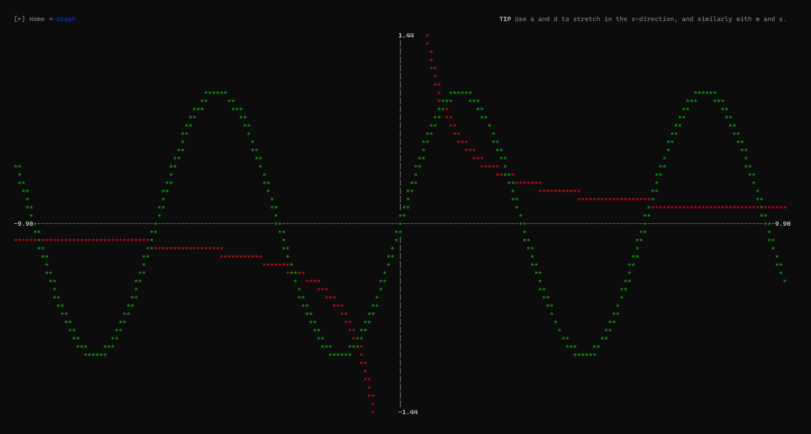

# Termigraph

A graphing calculator for your terminal. Built in Node.js and using my `parsemath` algorithm. It supports complex equations involving trigonometric functions, and up to four graphs can be plot at the same time.

It supports live graph scaling in the window using keyboard keys, and the ability to increase the resolution of the plot.

Please note that at present the graph can only plot values mapping a single input to an output, so graphs like circles are not supported.

> The graphs of y = sin(x) and y = 1/x plot on the software

